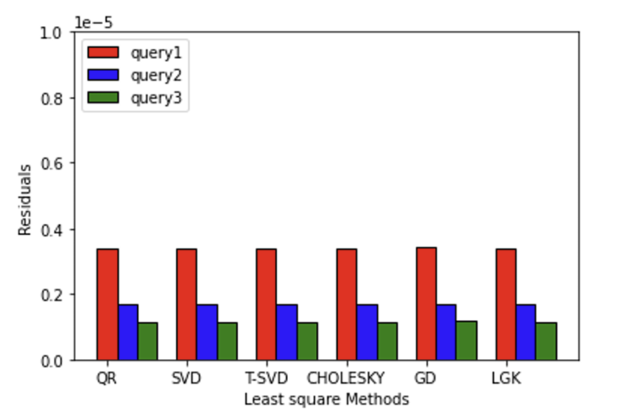
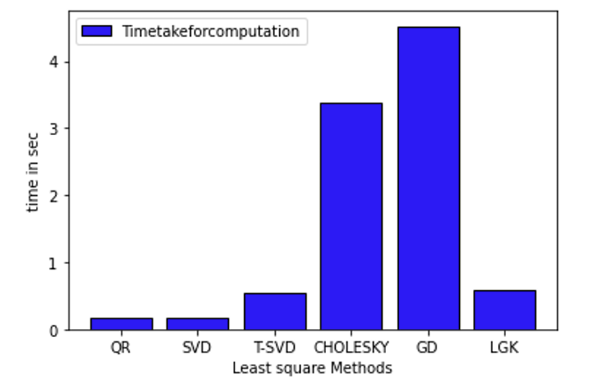
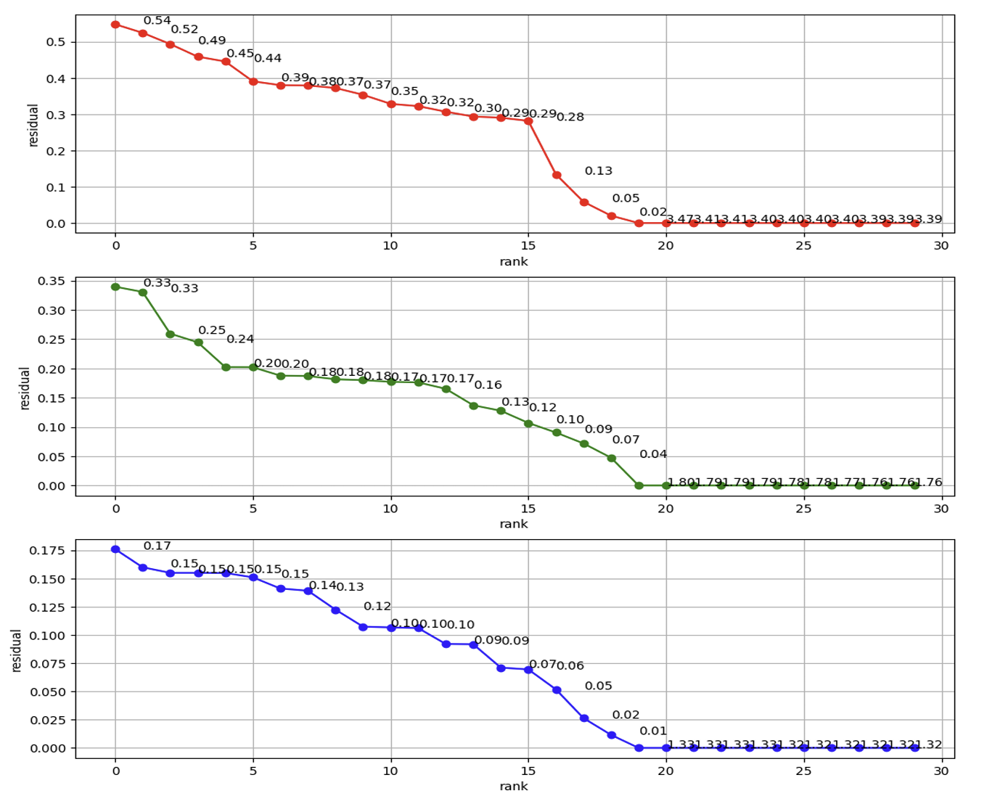
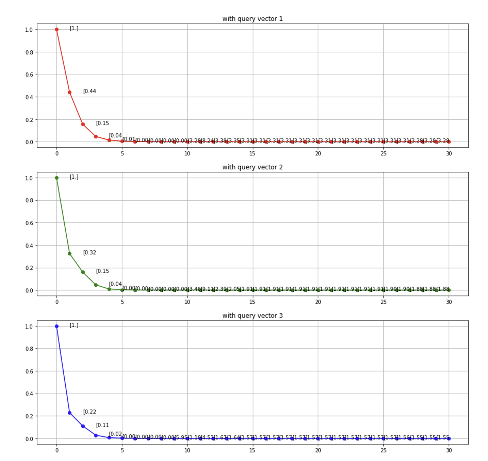
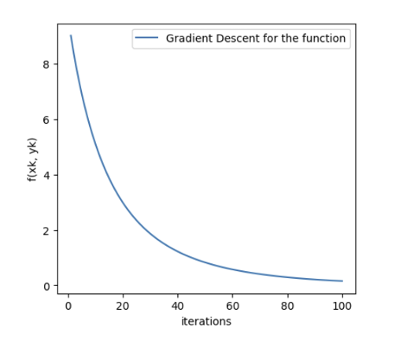
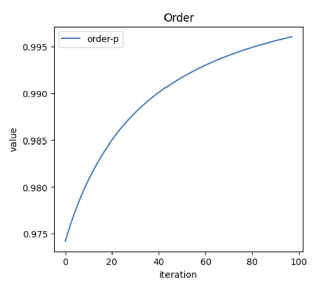
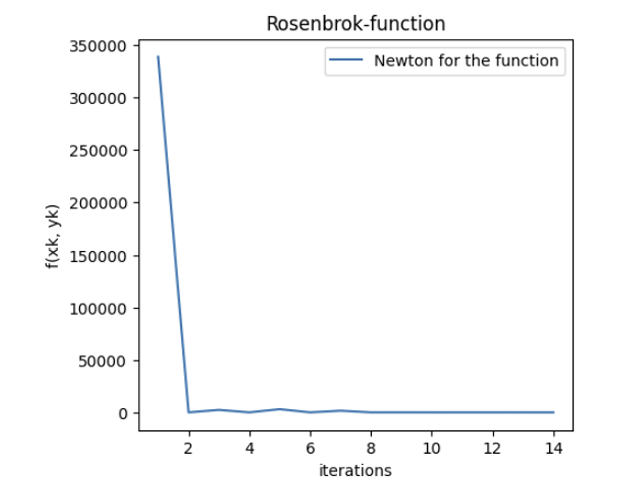
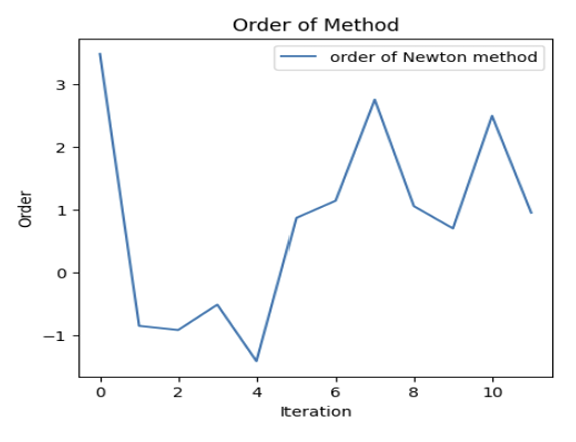

# Comparative Analysis of Least Squares Optimization Techniques Using Python

## Objective
To compare six least-squares solvers (QR, SVD, Truncated SVD, Cholesky, Gradient Descent, and LGK) on a sparse data system, and then study optimization using Gradient Descent and Newton’s method on a nonlinear function.

---

## Tasks Overview

### 1️⃣ Least Squares Problem
- Constructed sparse matrices **A (2000×20)** and **B (2000×30)**, where B’s last 10 columns were generated as `A·C_a + 1e-6·C_b`.
- Built three query vectors **q₁, q₂, q₃** = `B·x_i + 1e-5·c_i` with different sparsity levels (0.25, 0.6, 0.85).
- Solved the system **B·x ≈ q** using:
  - QR Decomposition  
  - SVD and Truncated SVD  
  - Cholesky  
  - Gradient Descent  
  - LGK (Least Gradient Krylov)
- Compared residuals and computation times for each solver.

---

## Key Comparisons

### Residuals Across Methods
Each bar represents the residual for query1, query2, and query3.

  

---

### Time Taken by Each Solver
QR and SVD were the fastest, while Gradient Descent took the longest.

  

---

### Truncated SVD: Residual vs Rank
Residual decreases as the number of singular values (rank `k`) increases.

  

---

### LGK Method: Residuals Over Iterations
Residuals dropping over iterations for each query vector show convergence.

  

---

## Observations
- **QR, SVD, and Cholesky** gave similar, low residuals quickly.  
- **Truncated SVD** accuracy depended on the number of singular values retained.  
- **Gradient Descent** required more time to converge but still achieved good accuracy.  
- **LGK** showed consistent convergence across all queries.

---

## Optimization Problem

In the second part, I compared **Gradient Descent** and **Newton’s Method** for minimizing a nonlinear function (Rosenbrock-type).

### Gradient Descent vs Newton’s Method

<table align="center">
<tr>
  <td align="center"><b>Gradient Descent - Objective Function</b></td>
  <td align="center"><b>Gradient Descent - Order of α</b></td>
</tr>
<tr>
  <td></td>
  <td></td>
</tr>
<tr><td colspan="2" align="center"><i>Gradient Descent: Objective value decreases steadily; α value increases smoothly as iterations proceed.</i></td></tr>

<tr><td colspan="2" height="20px"></td></tr> <!-- spacer row -->

<tr>
  <td align="center"><b>Newton Method - Objective Function</b></td>
  <td align="center"><b>Newton Method - Order of α</b></td>
</tr>
<tr>
  <td></td>
  <td></td>
</tr>
<tr><td colspan="2" align="center"><i>Newton Method: Reaches the minimum within ~14 iterations, showing much faster convergence than Gradient Descent.</i></td></tr>
</table>

---

## Results Summary

| Method | Residual (approx.) | Convergence Speed | Remarks |
|--------|--------------------|-------------------|----------|
| **QR / SVD** | Very low | Fast | Stable and accurate |
| **Truncated SVD** | Improves with rank `k` | Medium | Useful for dimension reduction |
| **Cholesky** | Low | Moderate | Works well for positive-definite systems |
| **Gradient Descent** | Slightly higher | Slow | Simple, easy to implement |
| **LGK** | Low | Medium | Consistent convergence |
| **Newton** | Lowest (for nonlinear case) | Fastest | Second-order convergence |

---

## Final Notes

I completed this project to understand the numerical differences between solvers and to see how optimization techniques actually behave beyond theory.
Each plot in this repository was generated from my own code and reflects the outcomes I observed while experimenting with these algorithms.

